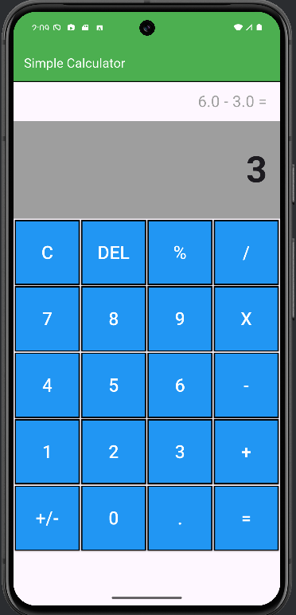

# Flutter-Calculator

## 📖 Description
This is a simple and clean **Calculator** app developed using **Flutter**.  
It supports basic arithmetic operations like addition, subtraction, multiplication, and division with a sleek and responsive user interface.  
Designed for both Android and iOS platforms.

---

## 🛠️ Features
- Basic arithmetic operations: `+`, `-`, `×`, `÷`
- Clear (`C`) and backspace (`⌫`) functionality
- Responsive layout for various screen sizes and orientations
- Real-time display of input and result
- Support for decimal numbers
- Simple and intuitive user interface with Material Design components

---

## 📱 Screenshots

<p align="center">
  
</p>

---

## 🧩 Project Structure

```plaintext
flutter_calculator/
├── lib/
│   ├── main.dart             # App entry point
│   ├── screens/
│   │   └── calculator_screen.dart  # Main calculator UI and logic
│   ├── widgets/
│   │   └── calculator_button.dart  # Custom button widget
│   └── utils/
│       └── calculator_logic.dart   # Calculation and input logic
├── assets/
│   └── [optional assets like icons]
├── pubspec.yaml              # Flutter project config and dependencies
└── README.md                 # This file

```
## 🧰 Dependencies
- flutter: SDK
- No external packages are required for the core functionality.

## 📝 Usage
- Tap the buttons to input numbers and operations.
- The calculator updates the display in real-time.
- Press = to calculate the result.
- Press C to clear all input.
- Press ⌫ to delete the last character.

## 🤝 Contributing
Contributions are welcome!
Feel free to submit bug reports, feature requests, or pull requests.
